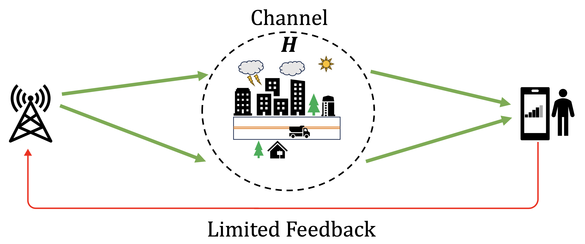
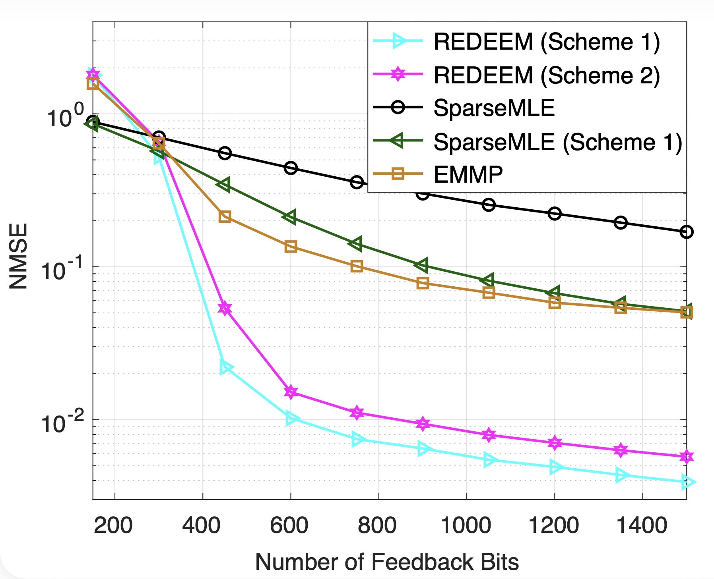
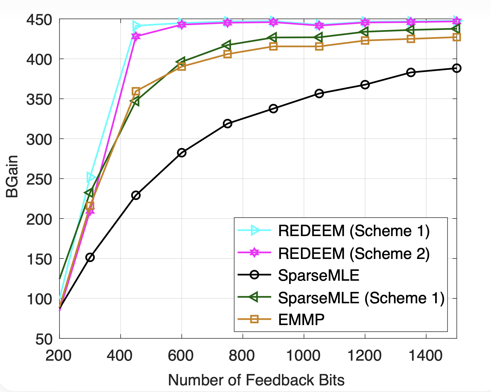

# Downlink MIMO Channel Estimation from Bits: Recoverability and Algorithm

This is the official implementation repository for ["Downlink MIMO Channel Estimation from bits: Recoverability and Algorithm"](https://ieeexplore.ieee.org/document/11106918), published in IEEE Transactions on Signal Processing. A shorter conference version of this paper is published in Asilomar 2025 that can be found [here](https://ieeexplore.ieee.org/document/10052071).

## Channel Estimation Problem Problem:
<p align='center' style="background-color:white;" >
    
    </br>
    </br>
    <figurecaption style='color: black'>Limited feedback scenario considered in this work.</figurecaption>
</p>
</br>

## Results
An _alternating direction method of multipliers_ (ADMM) algorithm, called REDEEM, is proposed for two different feedback schemes.

<p align='center' style="background-color:white;" >
    
    
    </br>
    </br>
    <figurecaption style='color: black'>Performance in antenna setup with 32 transmitter antennas, 24 receiver antennas, 8 channel paths and 3-bit quantization.</figurecaption>
</p>
</br>

## Usage
The script can be run in randomly generated geometric channel models and the channels generated using [DeepMIMO simulator](https://www.deepmimo.net)

**Main Function**

```
main(method_type, data_type, N_trials, Nr, Nt, K_true,R, quant_bits,K_model, test_name, data_file_path)

% Main script to run the experiments
% method_type: 'admm', 'newadmm', 'all'
% data_type: 'random', 'from_file'
% N_trials: number of trials to run
% Nr: number of receiver antennas
% Nt: number of transmitter antennas
% K_true: number of paths in the true channel
% R: number of measurements to be sent back
% quant_bits: number of bits to quantize each measurement
% K_model: number of paths in the model used for recovery
% test_name: name of the test to save data
% data_file_path: path to the data file if data_type is 'from_file' [only required if data_type is 'from_file']
```

**Trial run with random channels**
```
matlab -nodisplay -nosplash -nodesktop -r "main('all','random',10,16,32,6,300,2,6,'test');"
```
**Run with DeepMIMO datasets**
DeepMIMO datasets can be downloaded from [here](https://drive.google.com/drive/folders/1IFuxRqQbU4VqrVkrk5l8ZED5kHZ8KIe2?usp=share_link).

```
matlab -nodisplay -nosplash -nodesktop -r "main('all','from_file',10,16,32,6,300,2,6,'test',./deepmimo-datasets/user_channel_data_Boston5G_3p5_BS1_32x16antennas-deepmimov2.mat);"
```

## References
Please cite these on using this repository.
```

@ARTICLE{11106918,
  author={Shrestha, Rajesh and Shao, Mingjie and Hong, Mingyi and Ma, Wing-Kin and Fu, Xiao},
  journal={IEEE Transactions on Signal Processing}, 
  title={Downlink MIMO Channel Estimation from Bits: Recoverability and Algorithm}, 
  year={2025},
  volume={},
  number={},
  pages={1-15},
  keywords={Downlink;Channel estimation;Maximum likelihood estimation;Channel models;Dictionaries;Antenna arrays;Vectors;US Government;Science - general;Training;Channel estimation;compression;quantization;limited feedback;recoverability},
  doi={10.1109/TSP.2025.3593414}}


@INPROCEEDINGS{10052071,
  author={Shao, Mingjie and Fu, Xiao},
  booktitle={2022 56th Asilomar Conference on Signals, Systems, and Computers}, 
  title={Massive MIMO Channel Estimation via Compressed and Quantized Feedback}, 
  year={2022},
  volume={},
  number={},
  pages={1016-1020},
  keywords={Maximum likelihood estimation;Quantization (signal);Channel estimation;Massive MIMO;Downlink;Harmonic analysis;Frequency conversion;channel state information;matrix/tensor recovery;quantization;compression},
  doi={10.1109/IEEECONF56349.2022.10052071}}

@misc{alkhateeb2019deepmimo,
      title={DeepMIMO: A Generic Deep Learning Dataset for Millimeter Wave and Massive MIMO Applications}, 
      author={Ahmed Alkhateeb},
      year={2019},
      eprint={1902.06435},
      archivePrefix={arXiv},
      primaryClass={cs.IT},
      url={https://arxiv.org/abs/1902.06435}, 
}

```